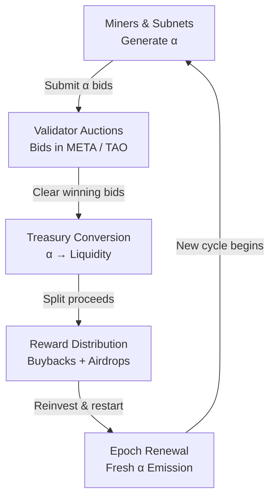
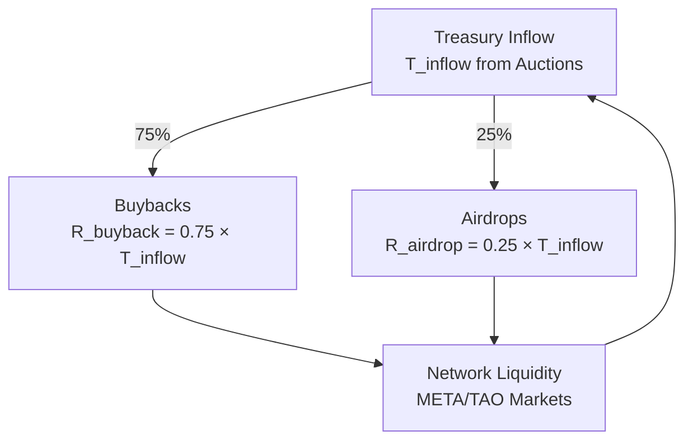

<div style={{
  padding: '0.75rem 1rem',
  background: 'rgba(128, 128, 128, 0.08)',
  border: '1px solid rgba(128, 128, 128, 0.2)',
  borderRadius: '8px',
  margin: 0
}}>
  <p style={{
    fontSize: '1rem',
    lineHeight: '1.6',
    margin: 0,
    color: 'inherit'
  }}>
    MetaHash isn't a marketplace or an exchange — it's a **liquidity engine**. Every subnet in Bittensor produces value called **α** (alpha). MetaHash transforms that output into usable liquidity through validator-cleared auctions and synchronized treasuries, creating a closed, self-balancing economy where value constantly moves.
  </p>
</div>

## MetaHash in Motion

MetaHash acts like the **heart of liquidity** in Bittensor — pumping META and TAO through the network in steady, predictable cycles.

- **Miners and Subnets** generate α — proof of intelligence output.
- **Validators** compete to buy α, setting fair on-chain prices.
- **Treasuries** collect liquidity and reissue rewards.
- **Holders** and **funds** receive yield through buybacks and airdrops.

Each role contributes to the motion — together, they keep the network alive. Liquidity never stands still; it flows through MetaHash like oxygen through an organism.

## Why the Liquidity Loop Exists

Each subnet emits **α** as proof of the intelligence or compute it contributes. On its own α is not liquid, so MetaHash provides the bridge from production to spendable value.

```
α_i = E_i × Q_i
```

`E_i` is the emission rate for subnet `i`, and `Q_i` reflects performance. MetaHash aims to keep rewards tied to that measurable output, not speculation.

<div style={{
  padding: '0.75rem 1rem',
  background: 'rgba(255, 140, 0, 0.12)',
  border: '2px solid rgba(255, 140, 0, 0.5)',
  borderRadius: '8px',
  margin: '1.5rem 0 0'
}}>
  <p style={{
    fontSize: '1.05rem',
    lineHeight: '1.6',
    margin: 0,
    color: '#ff8c00',
    fontWeight: '600'
  }}>
    The goal is simple: every unit of α should find a buyer, clear predictably, and return as liquidity that supports the entire metagraph.
  </p>
</div>

## Epoch Rhythm: 360-Block Cadence

MetaHash runs a full liquidity cycle every **360 blocks** (≈72 minutes). Miners, validators, and treasuries act in lockstep:

1. **α submission** – Miners post subnet ID, α amount, and desired discount.
2. **Validator auctions** – Validators bid in META/TAO and rank supply using the shared score `score = α × (1 - discount)`.
3. **Deterministic clearing** – The clearing price is the ratio between total bids and α sold.

```
P_α = Σ bids / Σ α_sold
```

4. **Treasury conversion** – Winning validators transfer META/TAO for α and log results to IPFS + chain.
5. **Reward execution** – Treasuries split inflow into buybacks and airdrops before the next epoch begins.



### Phase-by-phase view

<table style={{
  borderCollapse: 'collapse',
  width: '100%',
  margin: '1.5rem 0',
  border: '2px solid rgba(255, 140, 0, 0.4)'
}}>
  <thead>
    <tr>
      <th style={{
        background: 'linear-gradient(135deg, rgba(255, 140, 0, 0.2) 0%, rgba(255, 140, 0, 0.15) 100%)',
        color: '#ff8c00',
        fontWeight: '700',
        padding: '0.875rem 1rem',
        border: '2px solid rgba(255, 140, 0, 0.4)',
        textAlign: 'left'
      }}>Phase</th>
      <th style={{
        background: 'linear-gradient(135deg, rgba(255, 140, 0, 0.2) 0%, rgba(255, 140, 0, 0.15) 100%)',
        color: '#ff8c00',
        fontWeight: '700',
        padding: '0.875rem 1rem',
        border: '2px solid rgba(255, 140, 0, 0.4)',
        textAlign: 'left'
      }}>Blocks</th>
      <th style={{
        background: 'linear-gradient(135deg, rgba(255, 140, 0, 0.2) 0%, rgba(255, 140, 0, 0.15) 100%)',
        color: '#ff8c00',
        fontWeight: '700',
        padding: '0.875rem 1rem',
        border: '2px solid rgba(255, 140, 0, 0.4)',
        textAlign: 'left'
      }}>What happens</th>
    </tr>
  </thead>
  <tbody>
    <tr>
      <td style={{
        padding: '0.875rem 1rem',
        border: '1px solid rgba(255, 140, 0, 0.3)',
        background: 'rgba(255, 140, 0, 0.05)',
        fontWeight: '600'
      }}><strong>Prep</strong></td>
      <td style={{
        padding: '0.875rem 1rem',
        border: '1px solid rgba(255, 140, 0, 0.3)',
        background: 'rgba(255, 140, 0, 0.05)'
      }}>0–50</td>
      <td style={{
        padding: '0.875rem 1rem',
        border: '1px solid rgba(255, 140, 0, 0.3)',
        background: 'rgba(255, 140, 0, 0.05)'
      }}>Master Validators (MVs) settle prior trades and refresh budgets.</td>
    </tr>
    <tr>
      <td style={{
        padding: '0.875rem 1rem',
        border: '1px solid rgba(255, 140, 0, 0.3)',
        background: 'rgba(255, 140, 0, 0.05)',
        fontWeight: '600'
      }}><strong>Bidding</strong></td>
      <td style={{
        padding: '0.875rem 1rem',
        border: '1px solid rgba(255, 140, 0, 0.3)',
        background: 'rgba(255, 140, 0, 0.05)'
      }}>50–300</td>
      <td style={{
        padding: '0.875rem 1rem',
        border: '1px solid rgba(255, 140, 0, 0.3)',
        background: 'rgba(255, 140, 0, 0.05)'
      }}>Miners post α offers; validators collect and pin bids to IPFS.</td>
    </tr>
    <tr>
      <td style={{
        padding: '0.875rem 1rem',
        border: '1px solid rgba(255, 140, 0, 0.3)',
        background: 'rgba(255, 140, 0, 0.05)',
        fontWeight: '600'
      }}><strong>Verification</strong></td>
      <td style={{
        padding: '0.875rem 1rem',
        border: '1px solid rgba(255, 140, 0, 0.3)',
        background: 'rgba(255, 140, 0, 0.05)'
      }}>300–350</td>
      <td style={{
        padding: '0.875rem 1rem',
        border: '1px solid rgba(255, 140, 0, 0.3)',
        background: 'rgba(255, 140, 0, 0.05)'
      }}>Validators run the shared scoring formula and agree on winners.</td>
    </tr>
    <tr>
      <td style={{
        padding: '0.875rem 1rem',
        border: '1px solid rgba(255, 140, 0, 0.3)',
        background: 'rgba(255, 140, 0, 0.05)',
        fontWeight: '600'
      }}><strong>Settlement</strong></td>
      <td style={{
        padding: '0.875rem 1rem',
        border: '1px solid rgba(255, 140, 0, 0.3)',
        background: 'rgba(255, 140, 0, 0.05)'
      }}>350–360</td>
      <td style={{
        padding: '0.875rem 1rem',
        border: '1px solid rgba(255, 140, 0, 0.3)',
        background: 'rgba(255, 140, 0, 0.05)'
      }}>Treasuries pay winners, perform buybacks, and store proofs.</td>
    </tr>
  </tbody>
</table>

<div style={{
  padding: '0.75rem 1rem',
  background: 'rgba(255, 140, 0, 0.12)',
  border: '2px solid rgba(255, 140, 0, 0.5)',
  borderRadius: '8px',
  margin: 0,
  boxShadow: '0 2px 8px rgba(255, 140, 0, 0.15)'
}}>
  <p style={{
    fontSize: '1.05rem',
    lineHeight: '1.6',
    margin: 0,
    color: '#ff8c00',
    fontWeight: '600'
  }}>
    All auctions across SN73 fire in parallel. The block height is the metronome that keeps every validator on time.
  </p>
</div>

## Treasury Feedback Loop

Treasuries convert auction inflow into support for the network:

- **75%** goes to buybacks and liquidity reinforcement.
- **25%** goes to airdrops and subnet incentives.

```
R_buyback = 0.75 × T_inflow
R_airdrop = 0.25 × T_inflow
```



This closed loop keeps META moving instead of letting capital sit idle.

## Participant Incentives & Yield

MetaHash's design ensures that everyone who participates in the liquidity cycle benefits — fairly and transparently.

<table style={{
  borderCollapse: 'collapse',
  width: '100%',
  margin: '1.5rem 0',
  border: '2px solid rgba(255, 140, 0, 0.4)'
}}>
  <thead>
    <tr>
      <th style={{
        background: 'linear-gradient(135deg, rgba(255, 140, 0, 0.2) 0%, rgba(255, 140, 0, 0.15) 100%)',
        color: '#ff8c00',
        fontWeight: '700',
        padding: '0.875rem 1rem',
        border: '2px solid rgba(255, 140, 0, 0.4)',
        textAlign: 'left'
      }}>Participant</th>
      <th style={{
        background: 'linear-gradient(135deg, rgba(255, 140, 0, 0.2) 0%, rgba(255, 140, 0, 0.15) 100%)',
        color: '#ff8c00',
        fontWeight: '700',
        padding: '0.875rem 1rem',
        border: '2px solid rgba(255, 140, 0, 0.4)',
        textAlign: 'left'
      }}>What They Do</th>
      <th style={{
        background: 'linear-gradient(135deg, rgba(255, 140, 0, 0.2) 0%, rgba(255, 140, 0, 0.15) 100%)',
        color: '#ff8c00',
        fontWeight: '700',
        padding: '0.875rem 1rem',
        border: '2px solid rgba(255, 140, 0, 0.4)',
        textAlign: 'left'
      }}>What They Gain</th>
    </tr>
  </thead>
  <tbody>
    <tr>
      <td style={{
        padding: '0.875rem 1rem',
        border: '1px solid rgba(255, 140, 0, 0.3)',
        background: 'rgba(255, 140, 0, 0.05)',
        fontWeight: '600'
      }}><strong>Miners</strong></td>
      <td style={{
        padding: '0.875rem 1rem',
        border: '1px solid rgba(255, 140, 0, 0.3)',
        background: 'rgba(255, 140, 0, 0.05)'
      }}>Produce α based on subnet output</td>
      <td style={{
        padding: '0.875rem 1rem',
        border: '1px solid rgba(255, 140, 0, 0.3)',
        background: 'rgba(255, 140, 0, 0.05)'
      }}>Earn META/TAO liquidity through auctions</td>
    </tr>
    <tr>
      <td style={{
        padding: '0.875rem 1rem',
        border: '1px solid rgba(255, 140, 0, 0.3)',
        background: 'rgba(255, 140, 0, 0.05)',
        fontWeight: '600'
      }}><strong>Validators</strong></td>
      <td style={{
        padding: '0.875rem 1rem',
        border: '1px solid rgba(255, 140, 0, 0.3)',
        background: 'rgba(255, 140, 0, 0.05)'
      }}>Bid on α, verify results, clear auctions</td>
      <td style={{
        padding: '0.875rem 1rem',
        border: '1px solid rgba(255, 140, 0, 0.3)',
        background: 'rgba(255, 140, 0, 0.05)'
      }}>Gain auction spread and validator rewards</td>
    </tr>
    <tr>
      <td style={{
        padding: '0.875rem 1rem',
        border: '1px solid rgba(255, 140, 0, 0.3)',
        background: 'rgba(255, 140, 0, 0.05)',
        fontWeight: '600'
      }}><strong>Master Validators</strong></td>
      <td style={{
        padding: '0.875rem 1rem',
        border: '1px solid rgba(255, 140, 0, 0.3)',
        background: 'rgba(255, 140, 0, 0.05)'
      }}>Recycle and redistribute META, manage treasuries</td>
      <td style={{
        padding: '0.875rem 1rem',
        border: '1px solid rgba(255, 140, 0, 0.3)',
        background: 'rgba(255, 140, 0, 0.05)'
      }}>Maintain liquidity and network stability</td>
    </tr>
    <tr>
      <td style={{
        padding: '0.875rem 1rem',
        border: '1px solid rgba(255, 140, 0, 0.3)',
        background: 'rgba(255, 140, 0, 0.05)',
        fontWeight: '600'
      }}><strong>Holders</strong></td>
      <td style={{
        padding: '0.875rem 1rem',
        border: '1px solid rgba(255, 140, 0, 0.3)',
        background: 'rgba(255, 140, 0, 0.05)'
      }}>Stake or hold META tokens</td>
      <td style={{
        padding: '0.875rem 1rem',
        border: '1px solid rgba(255, 140, 0, 0.3)',
        background: 'rgba(255, 140, 0, 0.05)'
      }}>Receive airdrops and buyback yield</td>
    </tr>
  </tbody>
</table>

<div style={{
  padding: '0.75rem 1rem',
  background: 'rgba(255, 140, 0, 0.12)',
  border: '2px solid rgba(255, 140, 0, 0.5)',
  borderRadius: '8px',
  margin: 0,
  boxShadow: '0 2px 8px rgba(255, 140, 0, 0.15)'
}}>
  <p style={{
    fontSize: '1.05rem',
    lineHeight: '1.6',
    margin: 0,
    color: '#ff8c00',
    fontWeight: '600'
  }}>
    Every movement in the system creates shared value. The network grows because all roles depend on each other's participation — not speculation. MetaHash rewards contribution, not noise.
  </p>
</div>

## Cross-Treasury Synchronization

MetaHash runs many Master Validators instead of a single treasury. Each MV:

- Manages its own budget proportional to staked TAO.
- Hosts a full auction every epoch.
- Stores bids and results on chain + IPFS for auditability.

At block 360 every MV reports settlements, aligns reward ledgers, and, when needed, rebalances liquidity across peers. This creates a decentralized liquidity mesh instead of a single point of failure.

## Continuous Equilibrium

By the end of each epoch, inflows and outflows balance:

```
Σ α_sold ≈ Σ α_produced
Σ META_outflow = Σ rewards_distributed
```

That equilibrium is what keeps subnet emissions productive. α that enters MetaHash exits as actionable liquidity, reinforcing the same network that produced it.

## Renewal & Beyond SN73

Once settlement closes, the process restarts automatically: α emissions reset, new bids arrive, and fresh META cycles through buybacks and rewards. Because the cadence is predictable, other subnets and even outside strategists can plan against it, bridging META to TAO markets or tapping shared liquidity when needed.

MetaHash is more than a single subnet. It is the liquidity pulse of Bittensor — a calm, predictable beat that keeps intelligence work, capital, and incentives in sync.
