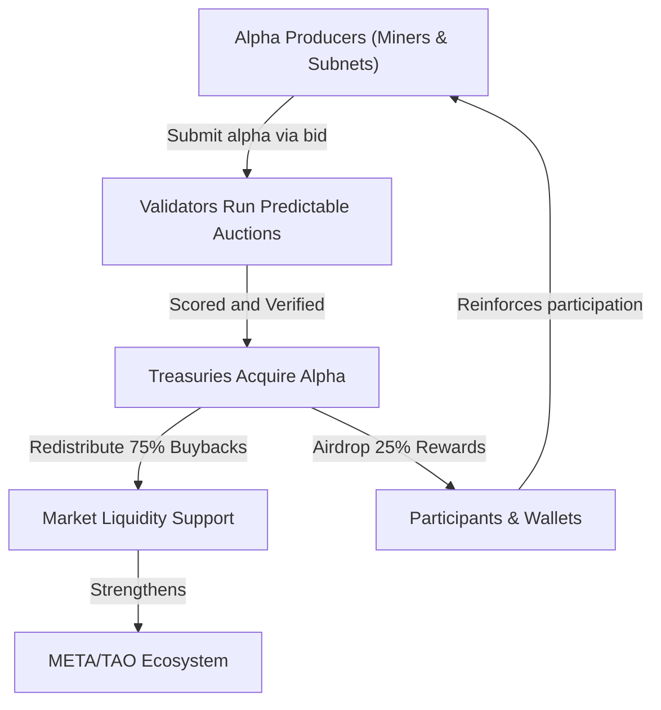

  

    MetaHash SN73 serves as Bittensor's liquidity coordination layer — transforming subnet output (α) into usable liquidity through validator-run predictable auctions and routing that liquidity across the network's ecosystem of subnets and treasuries.
  

Every **360 blocks** (≈72 minutes), MetaHash completes a synchronized cycle of α exchange, reward distribution, and liquidity rebalancing.
This repeating process is what keeps subnet economies connected, efficient, and fair.

## 1. The Purpose of the MetaHash Exchange

Each subnet in Bittensor creates **α**, a measure of its contribution or intelligence output.
But α alone isn't liquid — it needs a bridge to convert into spendable assets like META or TAO.

MetaHash provides that bridge.

It does this through:
- **Predictable auctions:** validator-cleared α sales that follow the same rules every epoch.
- **Distributed treasuries:** many Master Validators (MVs), each managing their own liquidity budgets.
- **Interoperable flow:** liquidity moving seamlessly between subnets through treasury settlements.

  

    This turns Bittensor's intelligence layer into an active economic layer — where subnet output constantly translates into network value.
  

## 2. The Predictable Auction Cycle (360 Blocks)

Every 360 blocks, MetaHash executes its liquidity cycle through validator-managed auctions.

<table style={{
  borderCollapse: 'collapse',
  width: '100%',
  margin: '1.5rem 0',
  border: '2px solid rgba(255, 140, 0, 0.4)'
}}>
  <thead>
    <tr>
      <th style={{
        background: 'linear-gradient(135deg, rgba(255, 140, 0, 0.2) 0%, rgba(255, 140, 0, 0.15) 100%)',
        color: '#ff8c00',
        fontWeight: '700',
        padding: '0.875rem 1rem',
        border: '2px solid rgba(255, 140, 0, 0.4)',
        textAlign: 'left'
      }}>Phase</th>
      <th style={{
        background: 'linear-gradient(135deg, rgba(255, 140, 0, 0.2) 0%, rgba(255, 140, 0, 0.15) 100%)',
        color: '#ff8c00',
        fontWeight: '700',
        padding: '0.875rem 1rem',
        border: '2px solid rgba(255, 140, 0, 0.4)',
        textAlign: 'left'
      }}>Block Range</th>
      <th style={{
        background: 'linear-gradient(135deg, rgba(255, 140, 0, 0.2) 0%, rgba(255, 140, 0, 0.15) 100%)',
        color: '#ff8c00',
        fontWeight: '700',
        padding: '0.875rem 1rem',
        border: '2px solid rgba(255, 140, 0, 0.4)',
        textAlign: 'left'
      }}>What Happens</th>
    </tr>
  </thead>
  <tbody>
    <tr>
      <td style={{
        padding: '0.875rem 1rem',
        border: '1px solid rgba(255, 140, 0, 0.3)',
        background: 'rgba(255, 140, 0, 0.05)',
        fontWeight: '600'
      }}><strong>Preparation</strong></td>
      <td style={{
        padding: '0.875rem 1rem',
        border: '1px solid rgba(255, 140, 0, 0.3)',
        background: 'rgba(255, 140, 0, 0.05)'
      }}>0–50</td>
      <td style={{
        padding: '0.875rem 1rem',
        border: '1px solid rgba(255, 140, 0, 0.3)',
        background: 'rgba(255, 140, 0, 0.05)'
      }}>Each Master Validator resets budgets and finalizes the previous epoch.</td>
    </tr>
    <tr>
      <td style={{
        padding: '0.875rem 1rem',
        border: '1px solid rgba(255, 140, 0, 0.3)',
        background: 'rgba(255, 140, 0, 0.05)',
        fontWeight: '600'
      }}><strong>Bidding</strong></td>
      <td style={{
        padding: '0.875rem 1rem',
        border: '1px solid rgba(255, 140, 0, 0.3)',
        background: 'rgba(255, 140, 0, 0.05)'
      }}>50–300</td>
      <td style={{
        padding: '0.875rem 1rem',
        border: '1px solid rgba(255, 140, 0, 0.3)',
        background: 'rgba(255, 140, 0, 0.05)'
      }}>Miners submit α offers (subnet ID, amount, discount). Validators record and rank them on IPFS.</td>
    </tr>
    <tr>
      <td style={{
        padding: '0.875rem 1rem',
        border: '1px solid rgba(255, 140, 0, 0.3)',
        background: 'rgba(255, 140, 0, 0.05)',
        fontWeight: '600'
      }}><strong>Verification</strong></td>
      <td style={{
        padding: '0.875rem 1rem',
        border: '1px solid rgba(255, 140, 0, 0.3)',
        background: 'rgba(255, 140, 0, 0.05)'
      }}>300–350</td>
      <td style={{
        padding: '0.875rem 1rem',
        border: '1px solid rgba(255, 140, 0, 0.3)',
        background: 'rgba(255, 140, 0, 0.05)'
      }}>Bids are scored using the shared formula: Score = α_amount × (1 - discount), so every validator reaches the same result.</td>
    </tr>
    <tr>
      <td style={{
        padding: '0.875rem 1rem',
        border: '1px solid rgba(255, 140, 0, 0.3)',
        background: 'rgba(255, 140, 0, 0.05)',
        fontWeight: '600'
      }}><strong>Settlement</strong></td>
      <td style={{
        padding: '0.875rem 1rem',
        border: '1px solid rgba(255, 140, 0, 0.3)',
        background: 'rgba(255, 140, 0, 0.05)'
      }}>350–360</td>
      <td style={{
        padding: '0.875rem 1rem',
        border: '1px solid rgba(255, 140, 0, 0.3)',
        background: 'rgba(255, 140, 0, 0.05)'
      }}>Treasuries execute payouts, clear auctions, and record state to the chain.</td>
    </tr>
  </tbody>
</table>

  

    All auctions across MetaHash run in parallel — synchronized by block height — creating a network-wide liquidity pulse every 360 blocks.
  

## 3. Treasury & Reward Flow

After settlement, each treasury automatically redistributes proceeds according to a transparent split:

- **75% → Buybacks & Liquidity Support**
  Used to stabilize subnet liquidity, META pairs, and validator operations.
- **25% → Airdrops & Wallet Rewards**
  Sent to miners, α sellers, and long-term holders.

Validators are rewarded for running fair auctions, verifying bids, and maintaining chain/IPFS state integrity.

  

    These actions keep liquidity balanced, circulating, and auditable across the network.
  

## 4. Network Interoperability: How MetaHash Connects Subnets

MetaHash isn't isolated. It operates as a **router** between subnets — linking computational work and financial liquidity.

### Inbound Flow (Subnet → MetaHash)
- Subnets produce α as part of their reward cycles.
- Miners can bring that α to MetaHash auctions to trade for META or TAO.
- Validators verify the origin subnet (via chain records) before acceptance.

### Outbound Flow (MetaHash → Subnets)
- After auctions, liquidity and buyback funds can flow *back* into subnet treasuries.
- Treasuries use these funds for validator rewards, miner incentives, or collateral stabilization.
- Airdrops ensure subnet contributors directly benefit from the broader liquidity network.

### Result: Network Coherence
Because all auctions follow the same 360-block cadence, value moves across subnets in rhythm.
SN73 acts as a **clearing hub**, ensuring α and liquidity stay in balance throughout the Bittensor economy.

  

    MetaHash synchronizes auctions and payouts across every subnet, ensuring the entire Bittensor economy moves to the same rhythm.
  

## 5. Multi-Treasury Coordination

Each treasury operates autonomously but remains synchronized through shared epoch timing.
This coordination ensures liquidity and rewards are distributed evenly across all validator-led treasuries.

<table style={{
  borderCollapse: 'collapse',
  width: '100%',
  margin: '1.5rem 0',
  border: '2px solid rgba(255, 140, 0, 0.4)'
}}>
  <thead>
    <tr>
      <th style={{
        background: 'linear-gradient(135deg, rgba(255, 140, 0, 0.2) 0%, rgba(255, 140, 0, 0.15) 100%)',
        color: '#ff8c00',
        fontWeight: '700',
        padding: '0.875rem 1rem',
        border: '2px solid rgba(255, 140, 0, 0.4)',
        textAlign: 'left'
      }}>Layer</th>
      <th style={{
        background: 'linear-gradient(135deg, rgba(255, 140, 0, 0.2) 0%, rgba(255, 140, 0, 0.15) 100%)',
        color: '#ff8c00',
        fontWeight: '700',
        padding: '0.875rem 1rem',
        border: '2px solid rgba(255, 140, 0, 0.4)',
        textAlign: 'left'
      }}>Description</th>
    </tr>
  </thead>
  <tbody>
    <tr>
      <td style={{
        padding: '0.875rem 1rem',
        border: '1px solid rgba(255, 140, 0, 0.3)',
        background: 'rgba(255, 140, 0, 0.05)',
        fontWeight: '600'
      }}><strong>Validator Treasury</strong></td>
      <td style={{
        padding: '0.875rem 1rem',
        border: '1px solid rgba(255, 140, 0, 0.3)',
        background: 'rgba(255, 140, 0, 0.05)'
      }}>Collects α from miners during auctions and distributes META/TAO post-settlement.</td>
    </tr>
    <tr>
      <td style={{
        padding: '0.875rem 1rem',
        border: '1px solid rgba(255, 140, 0, 0.3)',
        background: 'rgba(255, 140, 0, 0.05)',
        fontWeight: '600'
      }}><strong>Global Sync Layer</strong></td>
      <td style={{
        padding: '0.875rem 1rem',
        border: '1px solid rgba(255, 140, 0, 0.3)',
        background: 'rgba(255, 140, 0, 0.05)'
      }}>Ensures every treasury clears in the same 360-block rhythm, avoiding liquidity drift.</td>
    </tr>
    <tr>
      <td style={{
        padding: '0.875rem 1rem',
        border: '1px solid rgba(255, 140, 0, 0.3)',
        background: 'rgba(255, 140, 0, 0.05)',
        fontWeight: '600'
      }}><strong>Inter-Treasury Rebalancing</strong></td>
      <td style={{
        padding: '0.875rem 1rem',
        border: '1px solid rgba(255, 140, 0, 0.3)',
        background: 'rgba(255, 140, 0, 0.05)'
      }}>Enables optional balancing between validator pools if one exceeds or falls short of its target liquidity.</td>
    </tr>
    <tr>
      <td style={{
        padding: '0.875rem 1rem',
        border: '1px solid rgba(255, 140, 0, 0.3)',
        background: 'rgba(255, 140, 0, 0.05)',
        fontWeight: '600'
      }}><strong>Audit Layer (IPFS + Chain)</strong></td>
      <td style={{
        padding: '0.875rem 1rem',
        border: '1px solid rgba(255, 140, 0, 0.3)',
        background: 'rgba(255, 140, 0, 0.05)'
      }}>Keeps an immutable record of all treasury movements for transparency and verification.</td>
    </tr>
  </tbody>
</table>

  

    By linking many treasuries through predictable timing, MetaHash forms a coordinated liquidity web rather than a single centralized pool. The network becomes more stable as validator diversity increases.
  

## 6. The MetaHash Liquidity Loop

Every 360 blocks, the same cycle repeats — linking subnet production, validator auctions, and treasury recycling into one continuous flow.

This continuous loop creates a **self-sustaining liquidity engine** where:
- α holders get instant exits.
- Validators earn from clearing trades.
- Treasuries support network growth.
- The cycle repeats every 360 blocks, forever.

## Continue Learning
**Next:** [**Auction Mechanics →**](/understand-metahash/fundamentals/auction-mechanics)
Explore the detailed block-by-block timing and phases of MetaHash auctions.
